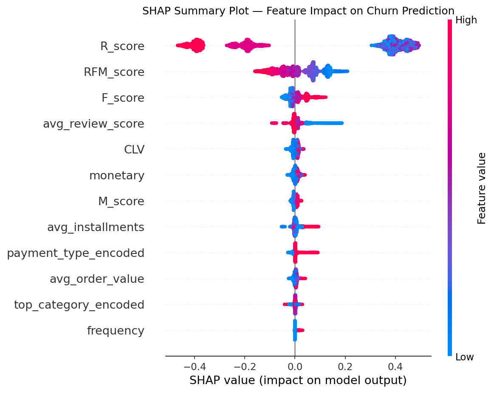
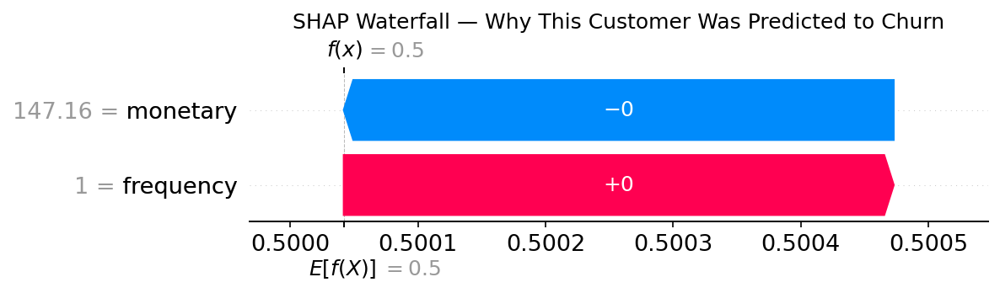

# E-Commerce Customer Churn Analysis & CLV Segmentation

## Problem

E-commerce platforms lose a significant share of customers after their first or second purchase. Without understanding **who** is likely to churn and **how valuable** they are, businesses waste retention budget on low-value customers while losing high-value ones.

Using the **Olist Brazilian E-Commerce dataset** (100K+ real orders across 9 relational tables), this project identifies churn patterns, segments customers by value, and predicts churn risk with explainable machine learning.

## Approach

**1. Data Engineering**
Merged 9 relational tables (orders, customers, payments, reviews, products, sellers) into a single customer-level dataset.

**2. Business-Driven Churn Definition**
Defined churn as **no purchase in 180 days**, based on the dataset's repurchase cycle — a business decision, not a pre-labeled column.

**3. RFM Segmentation & CLV Scoring**
Scored every customer on Recency, Frequency, and Monetary value (1–5 scale), then grouped them into six segments: Champions, Loyal, Promising, At Risk, Needs Attention, Lost. Calculated Customer Lifetime Value (CLV) for each.

**4. Predictive Modeling**
Trained a Random Forest classifier with SMOTE to handle class imbalance (70.9% churn rate).

**5. Explainability**
Used SHAP to explain both global feature importance and individual customer predictions.

**6. Business Intelligence Dashboard**
Built a 4-page Power BI dashboard for executive and operational stakeholders.

## Key Findings

| Metric | Value |
|---|---|
| Overall churn rate | 70.88% |
| Model ROC-AUC | 0.978 |
| Model F1 (churned class) | 0.92 |
| Customer segments identified | 6 |

- Customers with **low review scores (1–2 stars)** churn at significantly higher rates than those with 4–5 star ratings.
- **Boleto and voucher payment users** show higher churn than credit card users.
- The top SHAP drivers of churn are **recency**, **review score**, and **RFM score** — recent, satisfied, high-frequency customers are far less likely to churn.
- **At Risk** and **Lost** segments hold disproportionately high CLV relative to their size — meaning a large pool of previously valuable customers is going cold.

## Retention Recommendations

| Segment | Recommended Action | Trigger |
|---|---|---|
| Champions | Loyalty rewards program | After 3rd order |
| Loyal | Upsell premium products | Monthly campaign |
| Promising | Welcome discount on 2nd order | 7 days after 1st order |
| At Risk | Win-back coupon (15% off) | 90 days inactive |
| Needs Attention | Personalized recommendations | Email campaign |
| Lost | Last-chance offer (25% off) | 180 days inactive |

## SHAP Explainability

*Global feature importance — recency, review score, and RFM score are the strongest churn predictors.*

*Individual prediction explanation — shows exactly why one specific customer was flagged as high churn risk.*

## Dashboard Preview

The Power BI dashboard includes 4 pages:
- **Executive Overview** — KPIs, churn rate, revenue at risk, CLV
- **Churn Drivers** — payment method, review score, RFM score vs churn
- **RFM Segments** — segment distribution, CLV by segment, segment summary table
- **CLV Retention Priority** — churn probability vs CLV scatter, high-value customers at risk

## Tech Stack

- **Python**: pandas, numpy, matplotlib, seaborn, scikit-learn, imbalanced-learn, shap
- **Machine Learning**: Random Forest, SMOTE, SHAP
- **BI**: Power BI Desktop
- **Tools**: VS Code, Jupyter, Git/GitHub

## Business Impact

• Identified high-risk customer segments through RFM analysis.
• Achieved ROC-AUC of 0.97 and F1-score of 0.92 for churn prediction.
• Estimated Customer Lifetime Value to prioritize retention investments.
• Developed actionable retention strategies for Champions, Loyal, At-Risk, and Lost customers.
• Built an interactive Power BI dashboard for executive decision-making.
